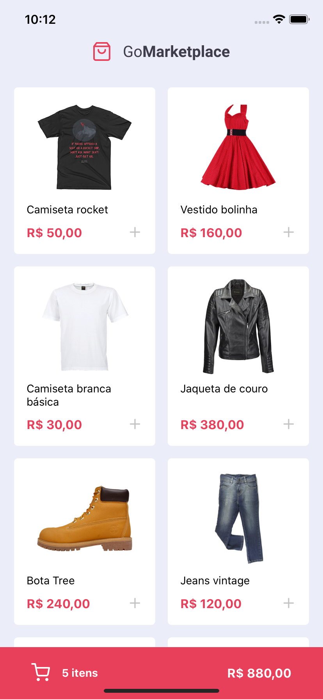
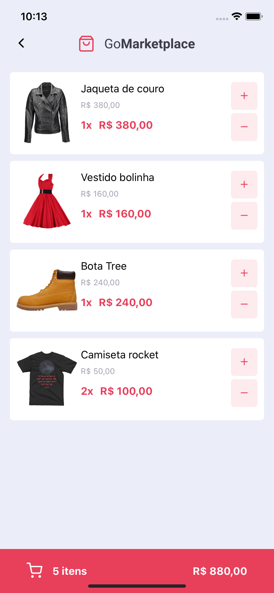

# ℹ️ About
Sample store app with:
- 👞 Products listing
- 🛒 Shopping cart

# 📷 Screenshots
<p style="display:flex; justify-content: space-between">
  
  
</p>

# 💻 Test locally

## Using yarn

### iOS
```sh
# Start the json server fake api and run development server
yarn
yarn json-server server.json -p 3333 & npx pod-install ios & yarn ios
```
### Android

```sh
# Start the json server fake api and run development server
yarn
yarn json-server server.json -p 3333 & yarn android
```

OR

## Using npm

### iOS
```sh
# Start the json server fake api and run development server
npm install
npx json-server server.json -p 3333 & npx pod-install ios & npm ios
```

### Android
```sh
# Start the json server fake api and run development server
npm install
npx json-server server.json -p 3333 & npm android
```
